# Contact Information

Jake Bernardi | jpbernardi2727@gmail.com

Cristian Cortez | cortezc041204@gmail.com 

Kyum Min Lee | kyummin90@gmail.com

# Diagnosing Performance Bugs

A program's performance can decline due to various reasons, from excessive memory access to inefficient loops.
It is essential to diagnose the bug that is causing the issue before making any modifications to the program.
In this document, we are going to give an overview of the tools that can be utilized to diagnose some of these issues. 

---

## Performance Monitoring Units

PMUs (Performance Monitoring Units) are parts that are integrated into the hardware to track hardware events such as cache misses or branch mispredictions. [General Overview of Cache Miss](https://en.wikipedia.org/wiki/Cache_(computing)#CACHE-MISS) [General Overview of Branch Prediction](https://en.wikipedia.org/wiki/Branch_predictor).
However, it tends to be a challenge to identify which of the events actually causes the performance declines.
That is why tools such as [Intel Vtune Profiler](https://www.intel.com/content/www/us/en/developer/tools/oneapi/vtune-profiler.html)  are used to give a predefined set of events to use as a reference.
Through these events, it is possible to narrow down on the hot-spot functions.

Current modern CPUs implement pipelining to use hardware resources in the most effective way possible.
Unfortunately, there are situations where the pipeline is completely idle without any instructions being executed, which causes performance decline.
By using TMA (Top Down Microarchitecture Analysis), it is possible to find the dominant performance bottlenecks in the application.
It is also possible to find out how much of the CPU pipelines is being used for the application.

Modern CPU pipelining is divided into "frontend" and "backend" components.
The frontend is what fetches the program code and decodes it into instructions.
It also breaks down the code into lower-level hardware operations called micro operations.
A micro operation (or µop) is the CPU’s internal mini-instruction.
A majority of x86 instructions decode into one or more micro operations that the core is able to schedule, execute, and retire.
The frontend then feeds the backend the micro operations, which is a process called “allocation”.
The backend executes the operation on an available unit.
Once the operation is executed, it is considered “retired.”
Most of these processes end up retiring, but some get cancelled due to branch mispredictions or other related issues.

On average, Intel’s CPU frontend is able to allocate, and the backend is able to execute 4 micro operations per cycle.
TMA makes the assumption that there are 4 pipelines for each core of the CPU.

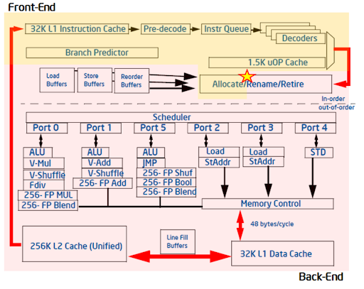
[^1]

### **Pipeline Stalling**

When a pipeline slot is empty during a cycle, it is considered a stall.
PMU events are able to show if the stall is due to a frontend or backend failure.

- If the frontend is the cause of the stall, it is referred to as frontend bound.
  It is due to the frontend’s inability to fill a slot with a micro operation.

- If a backend is the cause of the stall, it is referred to as a backend stall.
 It usually indicates the backend running out of resources, resulting in a stall.

- If a micro operation does not retire at all, it is called bad speculation.
  It can be caused by branch mispredictions.

- Lastly, if a micro operation is complete, it is considered retired.

- In cases when both the frontend and backend are causing the stall, it is considered a backend bound.
  This is due to the fact that fixing the frontend will not alleviate the situation, since the backend bottlenecks the performance.

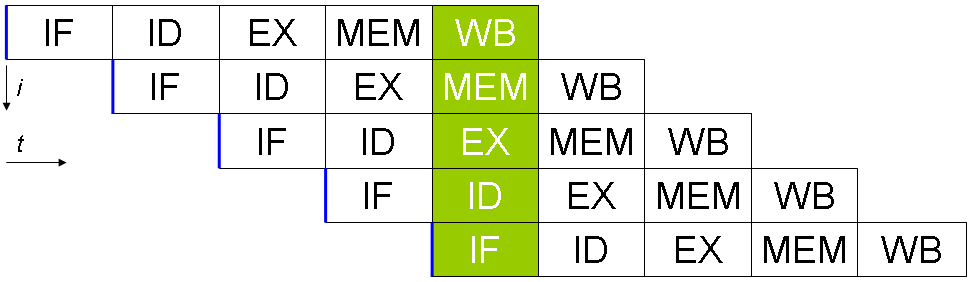
[^2]

The picture above gives a representation of the five stages in a pipeline. It is close to what you might have seen in a computer architecture class. These are the definitions of the stages:

- **Fetch (IF)**: Uses instruction pointers to retrieve the instruction that is going to be executed. It goes to L1 iTLB caches (dedicated instruction caches) to receive instructions.  
- **Decode (ID)**: Generates micro ops from the instructions that were fetched. Together with fetch (IF), the two stages count as a frontend of the pipeline. 
- **Execute (EX)**: As suggested by the name, execute involves sending the micro ops to arithmetic logic units (ALUs) to complete the instruction. 
- **Memory (MEM)**: Is the process when memory is accessed, either for loading or storing. It involves accessing the L1 cache to make these changes. 
- **Writeback (WB)**: Is when the register values are updated. This is when the updated values that were computed in EX and retrieved in MEM stage are stored. 

Of course, these steps are a simplified version of pipelining. Actual implementations such as the ones done by Intel are much more complex. 

Fetching indicates the processor receiving instructions.
The processor then decodes this instruction into micro operations in the decode stage.
This micro operation is then executed in the execute stage.
Data is read during the memory stage and, if required, the memory is then committed in the writeback stage.
The writeback and the memory stage can technically be combined into a single process, since it can be generalized to load and store memory.

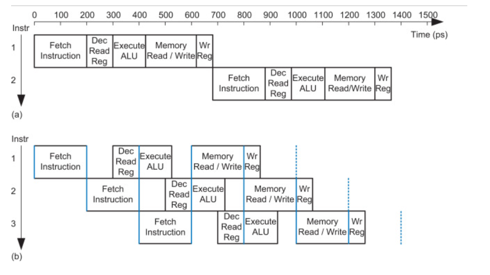
[^3]

A pipeline stage can be fetching instructions while another pipeline stage decodes or executes another instruction.
In essence, multiple instructions can be processed at once.
Non-pipelined systems would result in one instruction waiting for another instruction to complete, which results in significant delays.
Having multiple instructions run concurrently results in better utilization of the resources.

In cases where there are branches in the code, branch instructions can take a significant amount of time to execute.
Often, the branch is determined later in the processes, such as decode or execute.
In modern processors, branch targets are predicted based on previous executions to avoid waiting for the branch before fetching the instruction.
This is due to the fact that memory is read and committed in the following stages.
A clear decision has to be made whether the branch is mispredicted or not.

---

## Micro ops

One detail that matters when you start looking at PMU counters is that the CPU does not directly execute your x86 instructions.
The frontend first decodes them into micro-operations (µops), which are the smaller internal steps the core actually schedules and runs.

A single x86 instruction can expand into multiple µops.
For example, a memory add like:

```asm
add dword ptr [rdi], eax
```

is effectively doing a load, an add, and a store, so it may decode into 3 micro ops:

```asm
µop 1: load [rdi]
µop 2: add with eax
µop 3: store back to [rdi]
```

---

## TMA Hierarchy / Slot Buckets

TMA (Top-Down Microarchitecture Analysis) uses PMU events to estimate how the CPU’s pipeline slots are being used, then reports the result as fractions of total throughput.
The idea is simple: every cycle has a limited number of pipeline slots where useful work could have happened, and TMA tells you where those slots went.

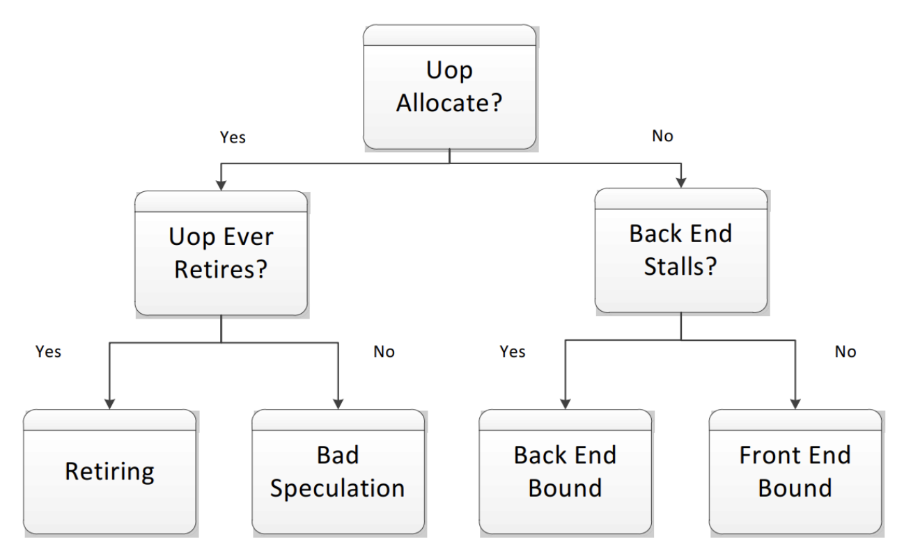[^1]

At the top level, TMA groups pipeline slots into four buckets.
(If you need more detail, you travel down the TMA hierarchy to break a broad category into more specific causes):

- **Frontend bound:** slots are empty because the frontend is not delivering µops fast enough (fetch, decode, or instruction supply problems, such as I-cache misses).

- **Backend bound:** µops are available, but the backend cannot make progress (often waiting on memory or limited by execution resources).

- **Bad speculation:** the CPU did work that got thrown away, most commonly due to branch misprediction, so those slots did not produce retired results.
- **Retiring:** useful work that is actually completed and committed to the CPU’s architectural state.

This breakdown immediately tells you whether you should be thinking about instruction supply (frontend), execution and memory behavior (backend), branch behavior (bad speculation), or whether the core is mostly doing productive work (retiring).

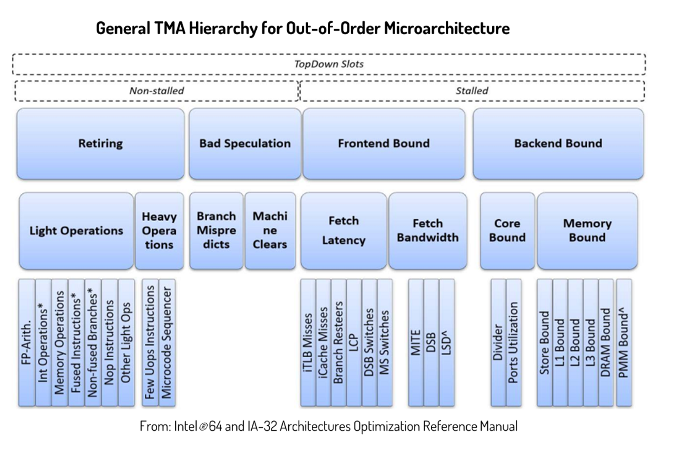[^10]

---

## Causes for Each Pipeline Stall Category

In the following section, we are going to discuss the main factors that might contribute to each pipeline stall category. It is essential to understand what might cause an increase in each category so that it is possible to narrow down on possible optimizations. 

### **Backend Bound**

Backend bound issues are usually due to the backend running out of resources to execute, causing latency.
Backend bound is divided into memory-bound and core-bound issues.
For the most part, backend bound issues are memory bound.
Examples of these are cache misses and memory accesses.

### **Front-End bound**

Frontend bound is mostly due to the frontend’s inability to fill a slot with a micro operation.
It is broken down into latency and bandwidth.
Latency occurs when there are no micro operations being issued by the frontend while the backend is waiting for any instructions.
Bandwidth is from having less than 4 micro operations issued per cycle, which is an inefficient use of the frontend.
This is because it is assumed that 4 micro operations are being issued per cycle, and under 4 micro operations per cycle indicates resources being underutilized.

### **Bad speculation**

Bad speculation is mostly by micro operations not retiring.
It is usually caused by branch mispredictions.
In this case, the pipeline is busy fetching and executing operations that end up being useless.
Branch mispredictions can also happen due to error handling.
This would be cases such as divide by zero error or page faults that might happen in the code.
These cases are uncommon and often unintended, and aren't necessarily negatively affecting the performance.

### **Retiring**

Lastly, once a micro operation is executed, it falls under the retiring category.
The results of the micro operation are committed to the architectural state, which are either CPU registers or main memory.
In the ideal cases, a majority of the instructions fall under this category, since it means that useful work is actually being committed to memory.

The question is how much of each category is considered “good” for a program.
Intel recommends around 50% retiring with 20% backend bound for client or desktop applications, with lower ranges of 10 ~ 30% retiring for server, database, or distributed applications.

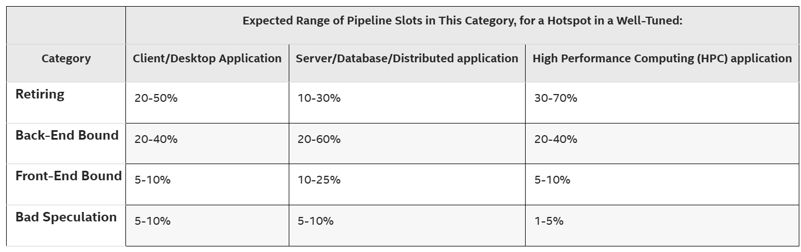 [^1]

---

## Resolving Bugs in Each Pipeline Stall Category

### **Backend Bound Issues**

The majority of issues will be back-end bound.
To begin, you will want to determine if the issue is core-bound or memory-bound, which can be determined using the various tools mentioned later in this week's summary.

For memory-bound issues, which are the most common, there are several solutions depending on the issue.

- Latency Bottleneck
  - Use prefetching to bring data into the cache before the CPU asks for it.
- Improving Throughput
  - Use batching/tiling to process data in chunks that fit into the L1/L2 cache to avoid frequent trips to RAM
  - Have more spatial locality by ensuring that data is stored contiguously in memory
- Data Layout
  - Make hot data smaller by using SoA, which is a [structure of arrays](https://en.wikipedia.org/wiki/AoS_and_SoA) rather than an array of structures. 
  - Use smaller data types if possible
  - Split structs into hot and cold structs.
    Rarely used data (cold) should be kept out of the main structure to keep frequently accessed data (hot) compact and cache-friendly.

Core-bound issues are less common. They occur when resources are not sufficiently utilized, resulting from things like excessive data dependencies or long-latency instructions. Some solutions include:  

- Compute Limits:
  - Reduce complexity by moving expensive operations out of hot code blocks
  - Vectorization: use SIMD (single instruction, multiple data) to perform the same operation on multiple data elements simultaneously
- Dependency Chains
  - Use multiple accumulators to break up dependency chains for expensive operations. This can be done through using separate variables to store intermediate results of a calculation.

<details> 
   <summary><b>Example: Using Multiple Accumulators</b></summary>
  
  ```cpp
  double sum = 0;
  for (int i = 0; i < n; i++) {
      sum += data[i];
  }
  ```

  In this simple code snippet, we are getting the sum of a vector. However, each addition must wait for the previous one to finish. This creates a dependency on the previous sum.

  ```cpp
  double acc1 = 0, acc2 = 0;
  for (int i = 0; i < n; i += 2) {
      acc1 += data[i];     // Independent of acc2
      acc2 += data[i + 1]; // Independent of acc1
  }
  double total_sum = acc1 + acc2;
  ```

  In the revised code snippet, we split the work between two independent variables, so the CPU can compute them in the same clock cycle.
</details>

- Use the -O3 flag

> **A note about the -O3 flag:**
> The compiler will perform helpful optimizations like loop unrolling and vectorization **ONLY** when it can ensure that it is fault-proof.
> If it cannot guarantee that its optimization will not change how the program functions, it will not optimize.
> Therefore, when using the -O3 flag you should ensure that your code is optimizable (or do the optimizations you expect yourself).

### **Frontend Bound Issues**

It is less common for front-end bound issues to be the program’s bottleneck, but there are still several cases that may occur.
Here are some of the most common:

- JIT issues
  - Just-in-time compilers create instruction streams dynamically at runtime, so the instructions can be scattered in memory.
  - This can increase pressure on the instruction translation lookaside buffer (iTLB), the small cache the CPU uses to remember address translations for instruction fetches, which can slow down instruction delivery.
- Optimizing Code Layout
  - Similar to resolving memory-bound issues on the back-end, you should try to reduce iTLB misses by moving rarely-used (cold) code out of the main execution path. Some examples are error handling, logging and debug checks.
  - -O3 flag: When utilized correctly, the compiler can perform function reordering and code layout changes to reduce the amount of branching and mispredictions

### **Bad Speculation Issues**

These issues are similar to an opportunity cost in performance. It is caused when the CPU does wasted work by mispredicting branches. It then has to throw the work away if the prediction was incorrect, which causes wasted processing power that could have been used for the correct instructions.

A few ways to prevent these issues:

- Reorder conditional statements so that the most common case is first
- Move cold paths out of hot loops, such as error handling or edge case checks that can be moved elsewhere
- The -O3 flag, again, can arrange the binary so that the likely path will be a straight fall-through
- Replace unpredictable branches with conditional moves when possible
  - If both outcomes are simple value selections, a conditional move can avoid the cost of a branch misprediction by selecting a result without changing control flow.

  <details>
    <summary><b>Example: Replacing a Branch with a Conditional Move</b></summary>

    ```cpp
    // Branch-based version
    int abs_val;
    if (x < 0) {
        abs_val = -x;
    } else {
        abs_val = x;
    }
    ```

    This version may compile to a branch, which can be costly if the condition is hard to predict.

    ```cpp
    // Branchless-style version
    int abs_val = (x < 0) ? -x : x;
    ```

    This version expresses the choice as a value selection instead of explicit control flow.
    On many targets, compilers can lower simple patterns like this to a conditional move rather than a branch.

  </details>

- In C++, there are also branch hint annotations, which can guide the compiler’s optimization of the instruction layout.

  <details> 
    <summary><b>Example: C++ Branch Hint Annotations</b></summary>

     ```cpp
    if (is_valid) [[likely]] {
        // High-performance hot path
    } else [[unlikely]] {
        // Less-likely cold path (error handling)
    }
    ```

  </details>

---

## Continuous Integration Approach

If you are working on a bigger project or with a team, it is likely that you have a Continuous Integration (CI) pipeline for your project.
These pipelines can also be used to generate performance statistics each time code is pushed, and to see how performance evolves over time.
We specifically want to mention some git-based tools (Gitlab pipelines and Git bisect), and another type of tool which fits into this same category (Continuous Profilers).

### **Gitlab Pipelines**

Gitlab Pipelines (and CI/CD pipelines in general) operate by automatically running a set of jobs on a machine of your choice every time you push a commit, open a merge request, or trigger a scheduled run.
Through pipelines, you can schedule benchmarks to run for each commit made.
A Gitlab pipeline is defined in a .gitlab-ci.yml file pushed to your repository, where you decide what commands run and what outputs get saved.
Gitlab can store these benchmarking results for you to review whenever you need them.

Pipelines provide three big benefits:

1. They help you pinpoint exactly which commit introduced a performance regression.
2. They run benchmarks in a standardized environment, which is especially helpful in team projects where everyone’s PC specs differ.
3. They execute automatically at push time so results are captured without manual effort.

More details about how to configure a pipeline on gitlab can be found here: [Gitlab Docs: CI/CD YAML syntax reference](https://docs.gitlab.com/ci/yaml/)

One catch is that not all runner machines are good benchmarking machines. Shared runners (or busy lab machines) can be noisy and dev boxes (local dedicated development machines) may not have the specs you want for testing production code.
A good compromise is to treat CI benchmarks as a regression detector, rather than precise measurer.
Whenever possible, you should run benchmarks on a dedicated self-hosted runner with stable hardware and running multiple iterations to weed out variations as best as possible.

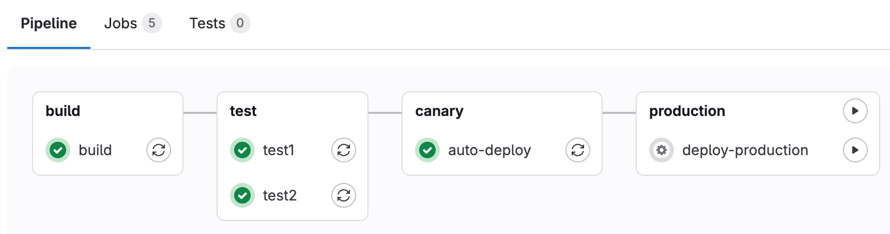[^4]

This figure shows a simple staged GitLab pipeline in the GitLab UI.
The pipeline has one job in the `build` stage, two parallel jobs in the `test` stage, one automatic deployment job in a `canary` stage, and one `deploy-to-production` job in the final production stage.
This illustrates the same idea discussed above: GitLab pipelines are organized into jobs and stages, stages run in sequence, and multiple jobs within the same stage can run in parallel.
That structure is useful for benchmarking work because it lets you build once, run multiple tests or benches in a standardized environment, and only continue to later deployment actions if the earlier validation steps succeed.

### **Git Bisect**

One downside of relying on CI runners for performance monitoring is that runner machines can be inconsistent or simply not an ideal production environment.
This allows machine variation to be mistaken as performance regression.
A useful alternative in this situation is the `git bisect` command.
`git bisect` is appropriate during a dedicated benchmarking session, where you repeatedly test past commits on the same machine to identify which commit introduced the regression.
Compared with pipeline-based benchmarking, this approach gives you more control over the hardware and system load, making it easier to benchmark on a stable, less busy, production-like machine.

`git bisect` lets you do a binary search over your commit history.
You tell Git one commit you know is good (performance is acceptable) and one commit you know is bad (performance is regressed).
Git then checks out a commit roughly halfway between them.
You test that commit (build and run a benchmark).
If it behaves like the “bad” version, you mark it bad; if it behaves like the “good” version, you mark it good.
Git repeats this process, halving the search space each time, until it isolates the first commit where the regression appears.
The binary search approach allows only benchmarking around $log_2(N)$ commits in a long history of N total commits (For example, 128 commits becomes ~7 tests).

For performance debugging, you can go one step further and use “git bisect run”, which automates the loop.
You write a script that builds the program, runs the benchmark, and exits with a status code that means “good” or “bad” based on a threshold (for example, “median runtime must be under X ms” or “throughput must be above Y ops/s”).
Then Git runs the binary search automatically, checking out commits and calling your script until it finds the culprit commit.

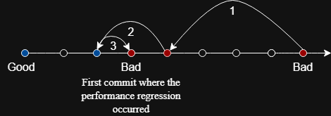

This figure shows the binary-search behavior of `git bisect` over commit history.
After each tested commit is marked good or bad, Git discards half of the remaining range and picks another midpoint to test.
This lets it isolate the first bad commit much faster than checking commits one by one. 
In this case, 3 benchmark runs are needed to determine the commit with the performance regression in a range of 7 total commits.

### **Continuous profiling**

Instead of only benchmarking at push time, a continuous profiler continuously collects CPU samples and stack traces from the processes running on a host, then stores them so you can inspect performance over long time windows.
This is especially valuable for distributed systems, where performance bugs often show up as intermittent latency spikes that do not reproduce in a local test.
The idea is: a change gets merged into production, you later see reports of response-time spikes, and then you open the profiler’s web UI to jump directly to the time range of those spikes and compare the collected stack traces against “normal” periods.
Many tools support this as a built-in visual diff (conceptually like a differential flame graph), which helps you identify what code paths (or kernel activity) became unusually hot during the incident.
Examples of continuous profilers include [Google Cloud Profiler](https://cloud.google.com/profiler/docs), [AWS CodeGuru Profiler](https://aws.amazon.com/codeguru/profiler/), [Datadog Continuous Profiler](https://docs.datadoghq.com/profiler/), [Parca](https://www.parca.dev/), and [Intel gProfiler](https://github.com/intel/gprofiler).
Among these, Parca stands out as a great open-source option.

---

## Memory and Microprocessor Speed

Over the years, processor speed has increased significantly, while memory speed hasn’t improved much.
Memory latency has been introduced due to the memory performance falling behind.

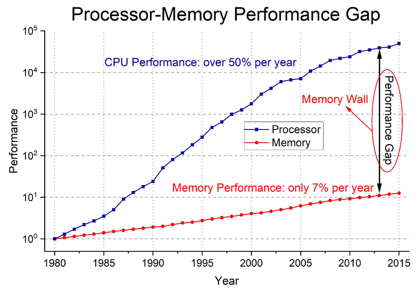 [^5]

### **How Memory Latency is Addressed**

The main question is how this memory latency is addressed.
No matter how fast the CPU becomes, it would always be bottlenecked by memory to a certain degree.
There are several factors that help alleviate this problem.
One of them is prefetching, where the required memory is predicted and fetched ahead of time.
Another factor is compiler optimization.
The compiler's -O1, -O2, and -O3 flags apply techniques such as code motion and loop unrolling to reduce the number of accesses to memory, thus mitigating the impact of higher memory latencies.
Lastly, in the hardware, multi-level caches are used to reduce the need to bring data from main memory.

---

## Multithreading

Multithreading creates the ability to split work in a program among threads to create parallelism. By breaking a task into independent execution streams, we can theoretically process data much faster. A naive approach with multithreading is to create as many threads as possible, which may sound like it would create a huge speedup in performance. However, it is important to understand [Amdal’s law](https://en.wikipedia.org/wiki/Amdahl%27s_law), which explains that there are diminishing returns of performance as you increase the thread count.

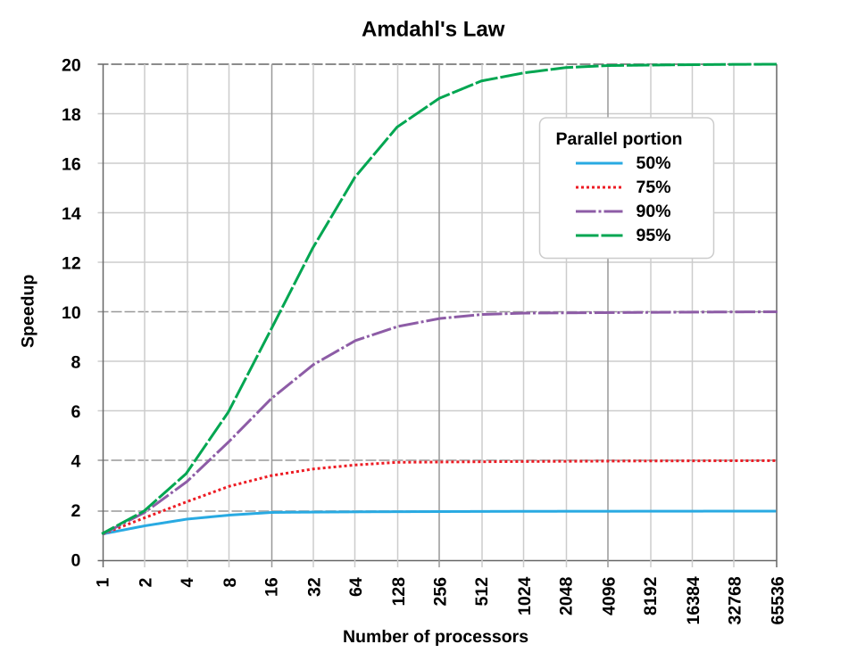[^6]

Here, you can see a comparison of speedup achieved with a logarithmic parallelization. The key represents the amount of the program that can be parallized. For example, if 50% of the program is parallelizable, the best possible speedup is 2x, no matter the number of threads, due to the constraints of the non parallelizable portion. Therefore, simply increasing the number of threads in a program will not always make it faster. 

A general rule of thumb to follow is to use up to the number of physical CPU cores for multithreading. In terms of splitting up tasks, you should consider an $n log(n)$ breakdown of work to get the sweet spot between load imbalance (too few tasks, not evenly distributed) and queue contention (too many tasks, large overhead). In this case, n is the number of cores. However, it is still valuable to experiment with the number of threads and see what works best for you.

---

## Diagnosing Performance Issues while Multithreading

There are many common performance mistakes you may make while multithreading. Typically, a performance bug is one of a handful of mistakes people keep re-discovering. You should keep these common sources of error in mind while writing your own concurrent programs.

### **False Sharing**

False sharing happens when multiple threads are writing to different variables, but those variables happen to live in the same 64-byte cache line.
Because caches move data around in cache-line chunks, the whole line gets passed back and forth between cores, which slows both threads down.

```cpp
#include <cstddef>

constexpr size_t N = 100000000;

struct Counters {
	int a;
	int b;
};

Counters c;

void t0() {
	for (size_t i = 0; i < N; i++) c.a++;
}

void t1() {
	for (size_t i = 0; i < N; i++) c.b++;
}
```

In code like this, `a` and `b` may sit in the same cache line, so both threads fight over one line even though they update different fields.

If you suspect false sharing, `perf c2c` is one of the most useful tools:

```bash
perf c2c record ./your_program
perf c2c report
```

In this case, c2c will likely report the same cache lines being written to from multiple cores. 
The solution is to try separating the fields so they cannot land on the same line.

```cpp
#include <cstddef>

constexpr size_t N = 100000000;

struct alignas(64) PaddedCounter {
	int value;
};

PaddedCounter a;
PaddedCounter b;

void t0() {
	for (size_t i = 0; i < N; i++) a.value++;
}

void t1() {
	for (size_t i = 0; i < N; i++) b.value++;
}
```

### **Load Imbalance**

Load imbalance means work isn’t split evenly between threads.
One thread gets stuck with more work (or harder work), and everyone else finishes early and waits.
Your speed ends up being limited by how long the slowest thread took.
As an example, the code below is a correct and reasonable way to split up work among threads, however, the code does not guarantee that any job will take longer than the others.
The approach below is oftentimes referred to as static chunking.

```cpp
void worker(size_t tid, size_t num_threads, const std::vector<Job>& jobs) {
	size_t chunk = jobs.size() / num_threads;
	size_t begin = tid * chunk;
	size_t end = (tid == num_threads - 1) ? jobs.size() : begin + chunk;

	for (size_t i = begin; i < end; i++) {
		process(jobs[i]);	// some jobs are much more expensive than others
	}
} 
```

You can spot this behavior directly by watching per-thread CPU usage using one of the commands below.
```bash
top -H -p <pid>
pidstat -t 1 -p <pid>
``` 

A common fix is dynamic scheduling, where threads pull the next unit of work as they become free instead of committing to a static chunk of work.

```cpp
#include <atomic>

std::atomic<size_t> next_job{0};

void worker(const std::vector<Job>& jobs) {
	while (true) {
		size_t i = next_job.fetch_add(1, std::memory_order_relaxed);
		if (i >= jobs.size()) break;
		process(jobs[i]);
	}
}
``` 

An easy way to avoid this class of bug is to use a runtime that already does dynamic scheduling for you.
For example, the same code from above is re-written with Intel oneTBB below.

```cpp
#include <tbb/parallel_for.h>
#include <tbb/blocked_range.h>

tbb::parallel_for(
	tbb::blocked_range<size_t>(0, jobs.size()),
	[&](const tbb::blocked_range<size_t>& r) {
		for (size_t i = r.begin(); i < r.end(); i++) {
			process(jobs[i]);
		}
	}
); 
```

[Intel oneTBB guide](https://www.intel.com/content/www/us/en/docs/onetbb/get-started-guide/2022-2/overview.html)

### **Shared Structures**

This refers to the situation where one object (a work queue, counter, hash table bucket, logging buffer, etc) are accessed often by multiple threads.
The program ends up spending a lot of time coordinating threads with locks and this shared spot can become a traffic jam.

```cpp
#include <mutex>
#include <queue>

std::mutex q_lock;
std::queue<Job> q;

void worker() {
	while (true) {
		q_lock.lock();
		if (q.empty()) {
			q_lock.unlock();
			break;
		}
		Job j = q.front();
		q.pop();
		q_lock.unlock();

		do_work(j);
	}
}
```

This queue is correct, but every single job requires all workers to serialize on the same lock.
`perf lock` is a good first tool here because it tells you which locks are highly contended for and how much time threads spend contending on them.

```bash
perf lock record ./your_program
perf lock report
```

A way to reduce the lock contention in the code above is to take batches of work (32 jobs) at a time, instead of only 1 job.

```cpp
#include <mutex>
#include <queue>
#include <vector>

std::mutex q_lock;
std::queue<Job> q;

void worker() {
	std::vector<Job> batch;
	batch.reserve(32);

	while (true) {
		batch.clear();

		{
			std::lock_guard<std::mutex> guard(q_lock);
			for (size_t i = 0; i < 32 && !q.empty(); i++) {
				batch.push_back(q.front());
				q.pop();
			}
		}

		if (batch.empty()) break;

		for (Job& j : batch) {
			do_work(j);
		}
	}
}
``` 

This is not the only solution, however.  
If possible, you can also shard the queue so each thread has a predefined piece of the original queue, although this approach is prone to load imbalance.  
A slightly more advanced version of this idea is to let each thread work from its own queue first, and only access another thread’s queue when it runs out of local work.  
This preserves most of the contention benefit of sharding while avoiding some load imbalance problems.  

### **Too Many Threads / Too Many Tiny Tasks**

This problem shows up when you create more runnable threads than the machine can execute efficiently, or when each task is so small that scheduling overhead is larger than the work itself.
The system burns cycles creating threads, switching contexts, or moving data through queues.

```cpp
#include <thread>
#include <vector>

void process_one(int& x);

void bad_parallel(std::vector<int>& data) {
	std::vector<std::thread> threads;
	threads.reserve(data.size());

	for (size_t i = 0; i < data.size(); i++) {
		threads.emplace_back([&, i]() {
			process_one(data[i]); // tiny unit of work
		});
	}

	for (auto& t : threads) t.join();
} 
```

In practice, it is advisable to sweep thread count to locate the best thread count for your program, like in the bash below. 
Do this with the understanding that, for CPU-bound code, the best result often appears near the number of hardware execution contexts your machine can sustain efficiently (For example, an 8-core CPU without SMT exposes 8 hardware threads, while an 8-core CPU with SMT enabled exposes 16). 

```bash
lscpu | egrep 'CPU\\(s\\)|Thread\\(s\\) per core|Core\\(s\\) per socket|Socket\\(s\\)'

for t in 1 2 4 8 16 32; do
	echo "threads=$t"
	for r in 1 2 3 4 5; do
		/usr/bin/time -f "%e" ./your_program --threads $t > /dev/null
	done
done
```

As another piece of advice, the oneTBB guide advises creating more independent work than there are worker threads and letting the scheduler choose the mapping onto threads, while choosing a chunk size large enough to amortize parallel scheduling overhead. [Intel oneTBB Task Based Programming Guide](https://www.intel.com/content/www/us/en/docs/onetbb/developer-guide-api-reference/2021-10/task-based-programming.html)

You can also measure the context switching overhead directly:

```bash
perf stat -e context-switches,cpu-migrations,task-clock ./your_program
```

Or, view which threads are switching a lot:

```bash
pidstat -w -t 1 
```

### **Lots of Barriers / Program Phases**

Threads are forced to meet up at checkpoints over and over.
Again, your speed ends up being limited by how long the slowest thread took.
An example of this might look like the following.

```cpp
#include <barrier>
#include <thread>
#include <vector>

constexpr int NUM_THREADS = 8;
std::barrier sync_point(NUM_THREADS);

void phase_work(int tid);

void bad_barrier_pattern() {
	std::vector<std::thread> threads;

	for (int t = 0; t < NUM_THREADS; t++) {
		threads.emplace_back([t]() {
			for (int phase = 0; phase < 100; phase++) {
				phase_work(t); // different threads may take different times
				sync_point.arrive_and_wait(); // everyone waits for the slowest one
			}
		});
	}

	for (auto& th : threads) th.join();
}
```

It is generally advisable to minimize the number of phases in your program as much as possible. 
If your program truly requires barriers, you should try to reduce their cost by:
- combining small phases into larger ones.
- rebalancing work dynamically within each phase.
- splitting unusually heavy work so that one thread does not become the straggler.
- using separate barriers for independent groups instead of forcing the entire program to synchronize at once.


### **NUMA**

NUMA (Non-Uniform Memory Access) is a memory architecture in which some memory is physically closer to certain cores. For our purposes, the key issue is that if a thread runs on one socket while reading data from RAM attached to another socket, those accesses can be much slower. 

If you’re working on a machine with NUMA, you can verify if NUMA is an issue by comparing your performance against when computation and memory allocation are kept on the same NUMA node.

```bash
numactl --hardware
numactl --cpunodebind=0 --membind=0 ./your_program
```

The first command shows the NUMA nodes available on the machine. The second runs the program on the CPUs of NUMA node 0 while allocating memory from node 0 as well. If this placement performs noticeably better than other placements, NUMA locality is likely affecting your program. 

### **Heisenbugs**

Heisenbugs are bugs that tend to disappear when you try to observe them. 
The program fails when running normally, but once you add print statements, debugging, or profiling, the timing changes which causes the bug to disappear.
These bugs almost always indicate that your program is incorrect under concurrency (watch out for a data race, failure to hold a lock for long enough, or other undefined behavior).

A simple data race which could cause a heisenbug is built into the code below:

```cpp
#include <thread>
#include <iostream>

int counter = 0;

void worker() {
	for (int i = 0; i < 100000; i++) {
		counter++; // data race: multiple threads update shared state without synchronization
	}
}

int main() {
	std::thread t1(worker);
	std::thread t2(worker);

	t1.join();
	t2.join();

	std::cout << "counter = " << counter << "\n"; // may be less than 200000
}
```

In this case, the fix is to synchronize access to shared state properly. Adding the atomic counter below fixes the bug.

```cpp
#include <atomic>
#include <thread>
#include <iostream>

std::atomic<int> counter = 0;

void worker() {
	for (int i = 0; i < 100000; i++) {
		counter++;
	}
}

int main() {
	std::thread t1(worker);
	std::thread t2(worker);

	t1.join();
	t2.join();

	std::cout << "counter = " << counter << "\n"; // consistently 200000
}
```

---

## Simultaneous Multithreading (SMT)

Unlike regular multithreading, which is managed by software, simultaneous multithreading(SMT)is a hardware feature and makes it possible for processors to run instruction threads on several threads on a single core. To achieve this without the data bleeding together, the CPU utilizes multiple sets of registers and a tagged TLB. The tagging of the TLB ensures that memory translations for one thread are isolated from another. This means that SMT can actually run threads of **different processes** simultaneously, which can be incredibly powerful.

The key idea of SMT is that by having threads share caches and cores, it would use more of the resources and result in better performance.

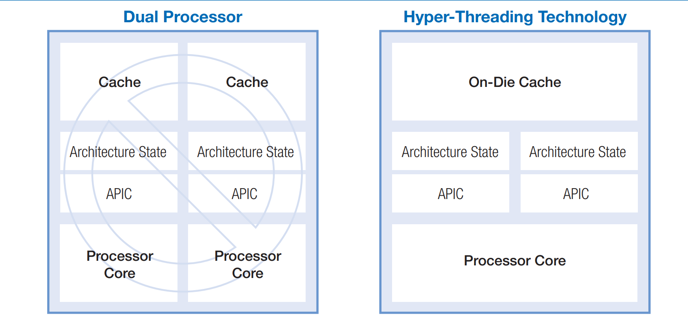[^7]

This is a diagram taken from Intel’s hyper-threading manual, which is their marketing term for SMT.
They indicate that hyper-threading is very different in nature compared to dual cores.
The threads share the same cache and processor cores while dual cores each have their own caches and processor cores.

### **Benefits of SMT**

The main objective of SMT is to maximize processor resource utilization and minimize the number of idle execution units. This helps hide memory latency because when one thead is stalled waiting for data, the core can immediately execute instructions form the other thread. 

According to Intel, a generic application would use 35% of the processor resources, which is considered pretty inefficient.
SMT solves this problem by feeding two independent instruction streams into the same physical core. Because the core is pulling from two separate pools of instructions, each stream only needs half as many execution units to max out the backend’s throughput. This makes it possible to increase the overall resource utilization to above 50%.

### **Considerations to Make While Using SMT**

Although SMT might seem like the solution to every problem, and would solve all memory latency issues, there are some factors to take into consideration.

### **Bus Optimizations**

While SMT improves core utilization, running multiple instruction streams simultaneously can significantly increase memory bus traffic. If the bus becomes saturated, performance will decline. To manage bus utilization effectively:

Some of the methods introduced are:

- Keeping code or data locality, which reduces trips to main memory
- Reducing the use of prefetch instructions
- Increasing back to back memory reads in the code

Overall, keeping spatial locality seems to reduce bus utilization, which, in turn, improves SMT performance.

### **Frontend Optimizations**

Because SMT hardware threads share the same physical core, they also must share the Instruction Cache (I-Cache). This means that developers should avoid optimizations that require more I-Cache to be efficient. Some ways to do this include:

- **Limit Loop Unrolling**: Loop unrolling is a common compiler optimization that reduces branch overhead, but it can create large, repeating blocks of code. With SMT, this can evict the other thread’s instructions from the shared I-Cache, which would hurt the performance.
- **Reuduce Overall Code Size**: Keeping the compiled binary as compact as possible will improve instruction locality. Smaller code will ensure that the hardware can comfortably fit the dynamic instruction streams of both threads inside the shared cache simultaneously. 

### **False Sharing, Again**

- If the D-cache is shared between multiple cores, it can potentially lead to associativity conflicts. This happens when the cores map too much memory to a single set, which leads to constant evictions.

---

## Execution Environments Thought Experiment

Imagine you run two micro-benchmarks back-to-back:

```bash
./benchmark --test_func_a
./benchmark --test_func_b --v1
```

Now imagine func_a and func_b are literally identical code. Why might the second run still be faster/slower?

<details> <summary>Answers</summary>

If both benchmarks share startup code, the second run may benefit from warmed-up branch prediction.
Small differences in where the code or data lands in memory can change things too.
If func_a and func_b live on different virtual memory pages (usually 4 KiB chunks), one run might incur an iTLB miss (address translation not cached) or an i-cache miss (instructions not cached) that the other doesn’t.

Even if the code is identical, background processes can run during your measurement window, causing noise through contention and context switching.

A surprising source of variation in tiny benchmarks is the process environment and startup state.
Even a flag that does nothing extra like --v1 can change the initial stack layout by slightly changing what gets placed on the stack at program start.
That shift changes stack addresses, which can change alignment and cache behavior especially in small benchmarks.

Finally, if you’re benchmarking in the cloud or inside a VM/container, your “CPU” is often sharing hardware with other users. Cloud providers may impose QoS controls (for example, partitioning or throttling shared resources like the LLC), and neighboring workloads can create performance variation even when your code doesn’t change.
</details>

### **How do we avoid these sources of variation in our benchmarks?**

Our advice is to try to keep the environment as consistent as possible and we recommend using Docker as a tool to help accomplish this.
You should also be cautious about micro benchmarking a lot of small functions / code flows inside one giant binary.
If you want to get closer to a true fair comparison between two pieces of code consider compiling them into their own binaries.
Additionally, consider using a benchmarking harness (a good example is Criterion for the Rust Programming Language).
Harnesses typically have built-in warmups and repeated trials to avoid measuring noise.
You could also of course design your own test harness to fit your needs.

---


## Summary of Useful Tools

When a program runs slowly or below expectation, the hardest part is often knowing where to start looking.
Below, you’ll find many important tools you may be expected to know as a performance engineer which are known for their effectiveness in diagnosing performance bugs.
The details on how to use these programs individually are out of the scope for this section and, as such, this section should be treated as a guide for when/how you should look to these important tools.

### **Perf (Linux)**

`perf` is often the best first profiler to try on Linux when you do not yet know why a program is slow as it can help answer several different questions from one interface.
Perf is lightweight compared to other tools and is convenient to use from the CLI. It provides a wide range of information: CPU cycles, instructions, cache and TLB misses, branch mispredictions, context switches, page faults, scheduler activity, etc.
For an examples-driven introduction and reference, see [Brendan Gregg, "Linux perf Examples"](https://www.brendangregg.com/perf.html) and the official [`perf(1)` man page](https://man7.org/linux/man-pages/man1/perf.1.html).
For a more concrete guide for multithreaded programs for choosing specific `perf` commands based on the symptoms you are seeing, refer to the **Diagnosing Performance Issues while Multithreading** section, where a scenario-based sequence of commands for common multithreaded performance problems is outlined.
If you are using `perf` to collect top-down or pipeline-bottleneck metrics on supported CPUs, the earlier **Resolving Bugs in Each Pipeline Stall Category** section is also a useful guide for what to do next based on your perf results.

### **Intel VTune**

Intel VTune is a profiler designed for Intel systems that combines hotspot analysis with deeper top-down microarchitectural analysis (TMA).
Because VTune supports TMA, the earlier **Resolving Bugs in Each Pipeline Stall Category** section naturally applies here.
VTune is more powerful than perf in terms of diagnosing the source of slow down as well as interpreting the results.
VTune also has heap profiling capabilities which perf does not.
For Intel’s official documentation and getting-started material, see [Intel® VTune™ Profiler User Guide](https://www.intel.com/content/www/us/en/docs/vtune-profiler/user-guide/2023-1/overview.html) and [Get Started with Intel® VTune™ Profiler](https://www.intel.com/content/www/us/en/docs/vtune-profiler/get-started-guide/2025-0/overview.html).

### **AMD uProf**

AMD uProf plays a very similar role to Vtune but for AMD processors.
Like VTune, its value is in diagnosing the source of slow down as well as interpreting the results.
AMD uProf also supports top-down style pipeline-utilization results, including `Frontend_Bound`, `Bad_Speculation`, `Backend_Bound`, and `Retiring`, so the earlier **Resolving Bugs in Each Pipeline Stall Category** section applies directly here.
If you are profiling on AMD hardware and need more detail than a first pass with `perf`, uProf is a natural next tool if you have an AMD CPU.
AMD uProf also supports heap profiling, but it is exclusive to the CLI [`AMDuProfCLI`](https://docs.amd.com/r/en-US/57368-uProf-user-guide/Introduction).
For AMD’s official overview and documentation, see [AMD uProf](https://www.amd.com/en/developer/uprof.html), the [uProf User Guide](https://docs.amd.com/r/en-US/57368-uProf-user-guide), and the [AMD uProf Getting Started Guide](https://docs.amd.com/r/en-US/68658-uProf-getting-started-guide).

### **Xcode Instruments (macOS)**

Xcode Instruments is the standard profiling suite for macOS and iOS.
If you’re working in Apple’s ecosystem, use Instruments to understand whether a slowdown comes from CPU work, allocation behavior, or system-level activity.
On Apple silicon, Instruments also offers a CPU Bottlenecks view that gives a similar high-level breakdown to the pipeline-stall categories discussed earlier, even though Apple uses different names for the buckets.
Because of that, the earlier **Resolving Bugs in Each Pipeline Stall Category** section is still a useful guide here.
For Apple’s official tutorials and reference material, see [Instruments Tutorials](https://developer.apple.com/tutorials/instruments) and [Xcode Documentation](https://developer.apple.com/documentation/xcode).

### **Flame graphs**

A flame graph is a visualization built from sampled call stacks.
Many times, a quick visual picture of where a program is spending its samples is enough to tell a performance engineer where to investigate next. 
For example, if the flame graph shows a wide stack under a function associated with memory access/allocation, that is a clue to examine that code path more closely. 
In doing so, you might likely use a memory profiler to help you determine the source of the slow down, and so on.
In this way, flame graphs are best treated as maps of likely hotspots that guide follow-up investigation. 
For a good general explanation of how flame graphs are built and used, see [Brendan Gregg, "Flame Graphs"](https://www.brendangregg.com/flamegraphs.html) and [Brendan Gregg, "CPU Flame Graphs"](https://www.brendangregg.com/FlameGraphs/cpuflamegraphs.html).

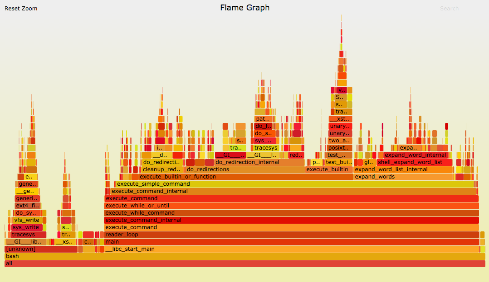 [^8]

Example CPU flame graph. 
Each box represents a function in a sampled call stack, and wider boxes indicate functions or code paths that appeared in more samples. 
The vertical direction shows stack depth, so boxes above are callees and boxes below are their callers. 
Adapted from [Brendan Gregg, "CPU Flame Graphs"](https://www.brendangregg.com/FlameGraphs/cpuflamegraphs.html).

### **Coz (causal profiling)**

Coz is a profiler, but it answers a different question than a traditional profiler.
A normal profiler shows where time is spent, while Coz estimates how much total performance would improve if a particular line of code became faster.
Coz will indicate regions which would improve overall throughput if made faster, and thus, you can focus your efforts there.
The opposite is also true, Coz can reveal that speeding up a region would barely improve end-to-end performance, and thus, you should stop focusing your energy on that region.
For the project itself and the original paper, see [plasma-umass/coz on GitHub](https://github.com/plasma-umass/coz) and [Curtsinger and Berger, “Coz: Finding Code that Counts with Causal Profiling” (SOSP 2015)](https://dl.acm.org/doi/10.1145/2815400.2815409).

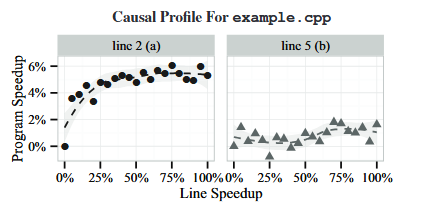[^9]

The graphs above are a causal profile from paper defining Coz. The x-axis shows a hypothetical speedup of a source line, and the y-axis shows the predicted end-to-end program speedup. In this example, speeding up `a()` helps modestly, while speeding up `b()` does not improve overall performance. Adapted from [Curtsinger and Berger, “Coz: Finding Code that Counts with Causal Profiling” (SOSP 2015)](https://dl.acm.org/doi/10.1145/2815400.2815409).

### **eBPF & GAPP**

eBPF is a kernel-level tracing mechanism for collecting runtime information with relatively low overhead.
A performance engineer uses eBPF-based tooling when ordinary profiling is not enough and the important behavior may be happening in the kernel or in thread interactions.
This is especially useful for problems involving blocking, serialization, waiting, or other system-level effects that are hard to see from application code alone.
GAPP is a profiler and analysis tool built on eBPF.
It helps diagnose serialization bottlenecks by collecting stack traces from blocked threads and from the threads causing the blocking.
As an example, If GAPP shows many threads blocked behind one code path, inspect that path as a likely serialization point.
Additionally, lock-heavy blocking patterns suggest revisiting your synchronization design entirely. [critical-section](https://learn.microsoft.com/en-us/windows/win32/sync/critical-section-objects) length, or work distribution.
For more reading on eBPF-based tracing, see [Brendan Gregg, "Linux eBPF Tracing Tools"](https://www.brendangregg.com/ebpf.html).
For the GAPP paper, see [Nair and Field, "GAPP: A Fast Profiler for Detecting Serialization Bottlenecks in Parallel Linux Applications"](https://dl.acm.org/doi/10.1145/3358960.3379136).

### **Memory Profiling**

Memory profiling can speed up your programs by helping you reduce the amount of memory your program uses.
As stated by Valgrind (a memory profiler), “a smaller program will interact better with your machine's caches and avoid paging.”
Ensuring there’s not an unexpectedly large memory footprint slowing you down (likely caused by memory leaks), many turn to memory profilers like Valgrind. Valgrind is discussed below, but Intel vTune (already discussed above) also has impressive memory profiling, and heaptrack is another popular tool known for having less overhead than Valgrind.

**Valgrind Massif** is useful for viewing heap usage over time.

Valgrind can be used to create a timeline of memory growth and helps identify when heap consumption becomes problematic.
If Valgrind does reveal unexpected growth, the typical next step is to inspect the responsible allocation sites and determine whether the issue is a leak, unnecessary retention, or avoidable heap usage and patch accordingly. 
You should use this tool or other similar tools to reduce your program’s size and ensure no leaks/unexpected growth. 
See how to use Valgrind: [Valgrind Massif Manual](https://valgrind.org/docs/manual/ms-manual.html).
See how to use heaptrack: [Heaptrack Manual](Ubuntu Manpage: heaptrack - heap memory profiler for linux, command line utility).

### Summary of Useful Tools (TLDR)

If you do not know where time is going, start with a general profiler such as `perf`, VTune, uProf, or Instruments depending on your platform and hardware.
If you want a clearer visual picture of hotspots, use a flame graph.
If you want to know which optimization would actually improve overall throughput, use Coz.
If the problem looks like waiting, blocking, or system-level interference, use eBPF-based tools such as GAPP.
If the slowdown may be caused by heap growth or allocation behavior, switch to memory profiling tools.
At the least, the goal is to be aware of the many tools at your disposal. Ideally, output from these tools will help advise your next steps in the diagnosing process as a performance engineer.

---

## References

AMD. (2026). "Introduction." *uProf User Guide (57368).* [Online]. Available: https://docs.amd.com/r/en-US/57368-uProf-user-guide/Introduction

AMD. (n.d.). "AMD μProf." [Online]. Available: https://www.amd.com/en/developer/uprof.html

AMD. (n.d.). "AMD uProf Getting Started Guide (Linux) (68658)." [Online]. Available: https://docs.amd.com/r/en-US/68658-uProf-getting-started-guide

AMD. (2026). "uProf User Guide (57368), version 5.2 English." [Online]. Available: https://docs.amd.com/r/en-US/57368-uProf-user-guide

Amazon Web Services. (n.d.). "Optimize Code Performance – Amazon CodeGuru Profiler." [Online]. Available: https://aws.amazon.com/codeguru/profiler/

Apple. (n.d.). "Profiling apps using Instruments." *Apple Developer Documentation*. [Online]. Available: https://developer.apple.com/tutorials/instruments

Apple. (n.d.). "Xcode." *Apple Developer Documentation*. [Online]. Available: https://developer.apple.com/documentation/xcode

Bakhvalov, D. (2024). *Performance Analysis and Tuning on Modern CPUs* (2nd ed.). Independently published. https://easyperf.net/perf-book/

Canonical Ltd. (n.d.). "heaptrack - heap memory profiler for linux, command line utility." *Ubuntu Manpages*. [Online]. Available: https://manpages.ubuntu.com/manpages/noble/man1/heaptrack.1.html

Curtsinger, C., and Berger, E. D. (2015). "Coz: Finding Code that Counts with Causal Profiling." *Proceedings of the 25th Symposium on Operating Systems Principles*. [Online]. Available: https://doi.org/10.1145/2815400.2815409

Datadog. (n.d.). "Continuous Profiler." [Online]. Available: https://docs.datadoghq.com/profiler/

GitLab. (n.d.). "CI/CD pipelines." *GitLab Docs*. [Online]. Available: https://docs.gitlab.com/ci/pipelines/

GitLab. (n.d.). "CI/CD YAML syntax reference." *GitLab Docs*. [Online]. Available: https://docs.gitlab.com/ci/yaml/

Google Cloud. (n.d.). "Cloud Profiler documentation." *Google Cloud Documentation*. [Online]. Available: https://cloud.google.com/profiler/docs

Gregg, B. (n.d.). "CPU Flame Graphs." [Online]. Available: https://www.brendangregg.com/FlameGraphs/cpuflamegraphs.html

Gregg, B. (n.d.). "Flame Graphs." [Online]. Available: https://www.brendangregg.com/flamegraphs.html

Gregg, B. (n.d.). "Linux eBPF Tracing Tools." [Online]. Available: https://www.brendangregg.com/ebpf.html

Gregg, B. (n.d.). "Linux perf Examples." [Online]. Available: https://www.brendangregg.com/perf.html

Sarah L. Harris, David Harris, 7 - Microarchitecture, Editor(s): Sarah L. Harris, David Harris,Digital Design and Computer Architecture,Morgan Kaufmann,2022,Pages 392-497,ISBN 9780128200643, https://doi.org/10.1016/B978-0-12-820064-3.00007-6.
(https://www.sciencedirect.com/science/article/pii/B9780128200643000076)
Abstract: This chapter discusses microarchitecture, particularly the design of three RISC-V processors: single-cycle, multicycle, and pipelined RISC-V processors that perform a subset of RISC-V instructions. It also discusses processor performance, dealing with data and control hazards, and advanced microarchitecture techniques, such as superscalar and out-of-order processors.
Keywords: microarchitecture; single-cycle; multicycle; pipelined; processor; RISC-V; hazards; advanced microarchitecture [Online] https://www.sciencedirect.com/science/chapter/monograph/abs/pii/B9780128200643000076

Intel Corporation. (2003). *Intel Hyper-Threading Technology: Technical User's Guide*. [Online]. Available: https://read.seas.harvard.edu/cs161/2022/pdf/intel-hyperthreading.pdf

Intel Corporation. (2022). "Top-down Microarchitecture Analysis Method." *Intel VTune Profiler Performance Analysis Cookbook*. [Online]. Available: https://www.intel.com/content/www/us/en/docs/vtune-profiler/cookbook/2023-0/top-down-microarchitecture-analysis-method.html

Intel Corporation. (n.d.). "Fix Performance Bottlenecks with Intel® VTune™ Profiler." [Online]. Available: https://www.intel.com/content/www/us/en/developer/tools/oneapi/vtune-profiler.html

Intel Corporation. (n.d.). "Get Started with Intel® oneAPI Threading Building Blocks (oneTBB)." [Online]. Available: https://www.intel.com/content/www/us/en/docs/onetbb/get-started-guide/2022-2/overview.html

Intel Corporation. (n.d.). "Get Started with Intel® VTune™ Profiler." [Online]. Available: https://www.intel.com/content/www/us/en/docs/vtune-profiler/get-started-guide/2025-0/overview.html

Intel Corporation. (n.d.). "Intel® VTune™ Profiler User Guide." [Online]. Available: https://www.intel.com/content/www/us/en/docs/vtune-profiler/user-guide/2023-1/overview.html

Intel Corporation. (n.d.). "intel/gprofiler." *GitHub*. [Online]. Available: https://github.com/intel/gprofiler

Intel Corporation. (n.d.). "Task-Based Programming." [Online]. Available: https://www.intel.com/content/www/us/en/docs/onetbb/developer-guide-api-reference/2021-10/task-based-programming.html

Kerrisk, M. (n.d.). "perf(1) - Linux manual page." *man7.org*. [Online]. Available: https://man7.org/linux/man-pages/man1/perf.1.html

Microsoft. (2021). "Critical Section Objects." *Microsoft Learn*. [Online]. Available: https://learn.microsoft.com/en-us/windows/win32/sync/critical-section-objects

Nair, R., and Field, T. (2020). "GAPP: A Fast Profiler for Detecting Serialization Bottlenecks in Parallel Linux Applications." [Online]. Available: https://doi.org/10.1145/3358960.3379136

Park, J., Choi, B. & Jang, S. Dynamic Analysis Method for Concurrency Bugs in Multi-process/Multi-thread Environments. Int J Parallel Prog 48, 1032–1060 (2020). https://doi.org/10.1007/s10766-020-00661-3 [Online] https://link.springer.com/article/10.1007/s10766-020-00661-3#citeas

Parca. (n.d.). "Parca - Open Source infrastructure-wide continuous profiling." [Online]. Available: https://www.parca.dev/

plasma-umass. (n.d.). "Coz: Causal Profiling." *GitHub*. [Online]. Available: https://github.com/plasma-umass/coz

S. Saini, H. Jin, R. Hood, D. Barker, P. Mehrotra and R. Biswas, "The impact of hyper-threading on processor resource utilization in production applications," 2011 18th International Conference on High Performance Computing, Bangalore, 2011, pp. 1-10, doi: 10.1109/HiPC.2011.6152743. keywords: {Radiation detectors;Instruction sets;Phasor measurement units;Computational fluid dynamics;Hardware;Performance gain;Bandwidth;Simultaneous Multi-Threading (SMT);Hyper-Threading (HT);Intel's Nehalem micro-architecture;Intel Westmere-EP;Computational Fluid Dynamics (CFD);SGI Altix ICE 8400EX;Performance Tools;Benchmarking;Performance Evaluation},[Online] https://ieeexplore.ieee.org/abstract/document/6152743?casa_token=HZ8_L0yUHaEAAAAA:QAESxOTl6EltWOzKy66pHc_AVfaKCaa_T6CFzJGlg4JqFlCOx7CK26ybcIIWoupXw0DCXemINw

Thomas Sterling, Matthew Anderson, Maciej Brodowicz, Chapter 6 - Symmetric Multiprocessor Architecture, Editor(s): Thomas Sterling, Matthew Anderson, Maciej Brodowicz, High Performance Computing, Morgan Kaufmann, 2018, Pages 191-224, ISBN 9780124201583, https://doi.org/10.1016/B978-0-12-420158-3.00006-X.
(https://www.sciencedirect.com/science/article/pii/B978012420158300006X)
Abstract: Symmetric multiprocessing is the most widespread class of shared-memory compute nodes. While nodes of this type can be used as self-contained computers, they serve more frequently as a building block of larger systems such as clusters. This chapter discusses typical components of a symmetric multiprocessing node and their functions, parameters, and associated interfaces. An updated version of Amdahl's law that takes overhead in account is introduced, along with other formulae determining peak computational performance of a node and the impact of memory hierarchy on a metric known as “cycles per instruction”. Finally, a number of commonly used industry-standard interfaces are discussed that permit attachment of additional peripheral devices, expansion boards, and performing input/output functions, and inspection of a node's internal state.
Keywords: Amdahl's law; Branch prediction; Cache-coherent computer; CPI; Ethernet; ILP; InfiniBand; Instruction mix; JTAG; Memory hierarchy; Memory wall; Multithreading; PCI express; Processor cache; Processor core; Processor socket; SATA; Shared-memory node; USB [Online] https://www.sciencedirect.com/science/chapter/monograph/abs/pii/B978012420158300006X

Valgrind Developers. (n.d.). "Massif: a heap profiler." *Valgrind User Manual*. [Online]. Available: https://valgrind.org/docs/manual/ms-manual.html

Wikimedia Commons. (n.d.). "File:Fivestagespipeline.png." [Online]. Available: https://commons.wikimedia.org/wiki/File:Fivestagespipeline.png

Wikipedia contributors. (n.d.). "Amdahl's law." *Wikipedia, The Free Encyclopedia*. [Online]. Available: https://en.wikipedia.org/wiki/Amdahl's_law

Wikipedia contributors. (n.d.). "AoS and SoA." *Wikipedia, The Free Encyclopedia*. [Online]. Available: https://en.wikipedia.org/wiki/AoS_and_SoA

Wikipedia contributors. (n.d.). "Branch predictor." *Wikipedia, The Free Encyclopedia*. [Online]. Available: https://en.wikipedia.org/wiki/Branch_predictor

Wikipedia contributors. (n.d.). "Cache (computing)." *Wikipedia, The Free Encyclopedia*. [Online]. Available: https://en.wikipedia.org/wiki/Cache_(computing)

Yasin, A. (2020). *A Top-Down Method for Performance Analysis and Counters Architecture*. arXiv:2004.05628 [cs.PF]. https://arxiv.org/abs/2004.05628

--

## Figure Citations

[^1]: Intel Corporation, “Top-down Microarchitecture Analysis Method,” Intel® VTune™ Profiler Performance Analysis Cookbook, May 19, 2023. [Online]. Available: https://www.intel.com/content/www/us/en/docs/vtune-profiler/cookbook/2023-0/top-down-microarchitecture-analysis-method.html

[^2]: Poil, “Instruction scheduling using a 5 stages pipeline,” Wikimedia Commons, May 14, 2005. [Online]. Available: https://commons.wikimedia.org/wiki/File:Fivestagespipeline.png

[^3]: A. Fog, “The microarchitecture of Intel, AMD, and VIA CPUs: An optimization guide for assembly programmers and compiler makers,” in Software Optimization Resources, Elsevier, 2013, ch. 7. [Online]. Available: https://www.sciencedirect.com/science/article/pii/B9780123944245000070

[^4]: Figure: Example GitLab CI/CD pipeline UI. Source: GitLab, “CI/CD pipelines,” GitLab Docs. [Online]. Available: https://docs.gitlab.com/ci/pipelines/

[^5]: K. Yu, M. Kim, and J. Choi, “Memory-Tree Based Design of Optical Character Recognition in FPGA,” Electronics, vol. 12, no. 3, p. 754, 2023. doi: 10.3390/electronics12030754.

[^6]: Daniels220, “AmdahlsLaw.svg,” Wikimedia Commons, Apr. 13, 2008. [Online]. Available: https://commons.wikimedia.org/wiki/File:AmdahlsLaw.svg

[^7]: Intel Corporation, Intel® Hyper-Threading Technology Technical User’s Guide, Jan. 2003, p. 13. [Online]. Available: https://read.seas.harvard.edu/cs161/2022/pdf/intel-hyperthreading.pdf

[^8]: B. Gregg, “CPU Flame Graphs.” [Online]. Available: https://www.brendangregg.com/FlameGraphs/cpuflamegraphs.html

[^9]: C. Curtsinger and E. D. Berger, “Coz: Finding Code that Counts with Causal Profiling,” in Proc. 25th Symposium on Operating Systems Principles (SOSP), 2015. [Online]. Available: https://doi.org/10.1145/2815400.2815409

[^10]: Intel. “Intel® 64 and IA-32 Architectures Software Developer’s Manual Combined Volumes: 1, 2A, 2B, 2C, 2D, 3A, 3B, 3C, 3D, and 4.” Intel, 2023 [Online]. Available: https://www.intel.com/content/www/us/en/content-details/782158/intel-64-and-ia-32-architectures-software-developer-s-manual-combined-volumes-1-2a-2b-2c-2d-3a-3b-3c-3d-and-4.html?wapkw=intel%2064%20and%20ia-32%20architectures%20software%20developer%27s%20manual&docid=782158 
